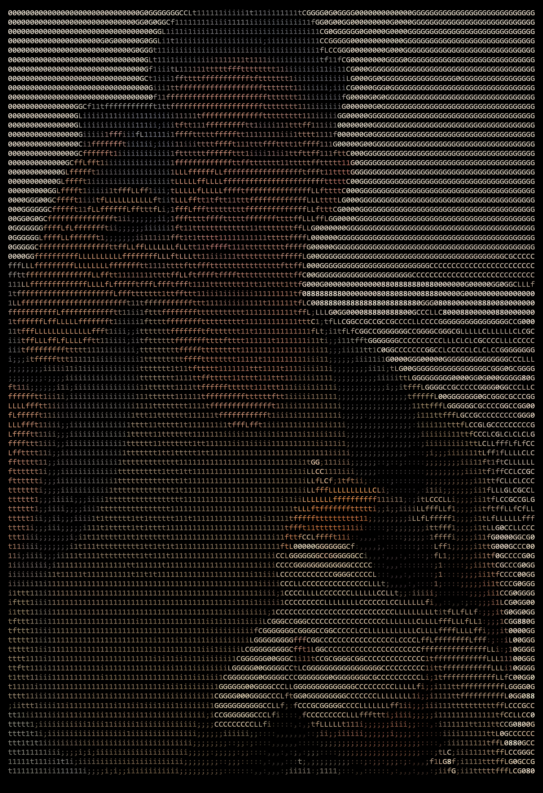

# Asciify
Image-to-ASCII art for the terminal with color support, multiple character sets, an interactive menu, and optional file output.

---

## Highlights
- Convert images to colored ASCII art in the terminal
- Interactive menu for quick configuration
- Export ASCII art as HTML or PNG **(refactor in progress, PNG donwload pending)**
- Download multiple output types from the same render **(refactor in progress)**

## Features

| Area | Details |
| --- | --- |
| Input | Local image files |
| Output | Terminal render or file output |
| Color | Preserves source image colors |
| Sets | Multiple ASCII character sets |
| UX | Interactive menu |

## Project Layout

| Path | Purpose |
| --- | --- |
| [Program.cs](Program.cs) | Entry point |
| [src/Menu.cs](src/Menu.cs) | Interactive menu and UI flow |
| [src/Renderize.cs](src/Renderize.cs) | Image-to-ASCII rendering engine |
| [src/Download.cs](src/Download.cs) | HTML and PNG export logic |
| [src/UserOptions.cs](src/UserOptions.cs) | User configuration model |
| [readme.md](readme.md) | Project documentation |

## Small demo :)
<table>
  <tr>
    
    
  </tr>
</table>

## Requirements
- .NET SDK 10.0 or later